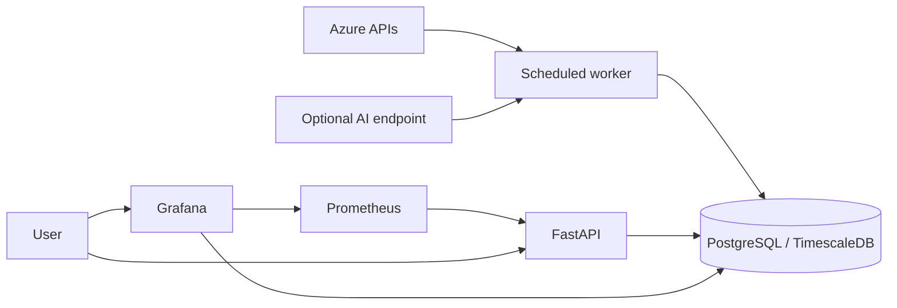

# Azure Cost Monitoring Multi-Agent Platform

A Docker-first FinOps platform for collecting Azure costs, visualizing spend, detecting budget risks, forecasting future cost, and generating reviewable optimization recommendations with an optional language model.

> The platform is advisory by default. It does not automatically modify Azure resources.

## Overview

The project combines Azure Cost Management and Resource Graph data with deterministic analysis and optional AI enrichment. A FastAPI service exposes the data, a dedicated worker runs scheduled workflows, PostgreSQL/TimescaleDB stores the results, and provisioned Grafana dashboards make them explorable.



## Current features

- Multi-subscription Azure cost collection; a blank subscription list discovers all accessible subscriptions.
- Cost summaries and trends by subscription, service, resource type, and resource.
- Budget rules, alerts, acknowledgements, and scheduled evaluation.
- Cost forecasts with confidence bounds and accuracy backfill.
- Tiered optimization recommendations with estimated savings and review status.
- Optional recommendation enrichment through Azure OpenAI or an OpenAI-compatible endpoint.
- Provider-neutral AI configuration with deterministic fallback when AI is disabled or unavailable.
- Reference-architecture reviews and optional Databricks/Spark analysis.
- FastAPI REST endpoints, Swagger UI, health probes, and Prometheus metrics.
- Four provisioned Grafana dashboards: Azure Cost Trends, AI Recommendations, Architecture Reviews, and Chargeback.
- Idempotent Alembic migrations and a separate APScheduler worker.

## Docker services

| Service | Purpose |
| --- | --- |
| `postgres` | TimescaleDB-backed canonical data store |
| `migrate` | One-shot Alembic migration job |
| `api` | FastAPI REST API and OpenAPI documentation |
| `worker` | Scheduled collection, alerting, forecasting, and recommendations |
| `prometheus` | API and runtime metrics collection |
| `grafana` | Provisioned FinOps dashboards |

## Quick start

### Prerequisites

- Docker Desktop with Docker Compose
- An Azure identity with `Reader` and `Cost Management Reader` access
- Optional Azure OpenAI or OpenAI-compatible model endpoint

### Start the platform

1. Clone the repository.
2. Copy `.env.example` to `.env`.
3. Replace every `CHANGE_ME` value with a different long random secret.
4. Configure Azure authentication. Leave `AZURE_SUBSCRIPTION_IDS` blank to monitor all subscriptions visible to the identity.
5. Optionally configure an AI provider, or retain `LLM_PROVIDER=disabled`.
6. Start and verify the stack:

   ```powershell
   docker compose up --build -d
   docker compose ps
   ```

7. Collect the latest Azure costs:

   ```powershell
   docker compose run --rm api cost-monitor collect --days 30
   ```

8. Open the services listed below.

For a complete walkthrough with screenshots, Azure permissions, AI configuration, validation, and troubleshooting, see the [setup guide](docs/setup-guide.md).

## Access

| Interface | Default URL |
| --- | --- |
| API documentation | <http://localhost:8000/docs> |
| API health | <http://localhost:8000/health> |
| Grafana | <http://localhost:3000> |
| Prometheus | <http://localhost:9090> |

Published ports can be changed in `.env`.

## Screenshots

### Interactive API documentation


### Grafana sign-in

Use `GRAFANA_ADMIN_USER` and `GRAFANA_ADMIN_PASSWORD` from your local `.env`.


### AI recommendations dashboard

Select a specific subscription for a focused view, or **All** for a consolidated view.


### Monitoring verification


## AI providers

AI is optional. Rule-based recommendations remain available with `LLM_PROVIDER=disabled`.

- **Azure OpenAI:** set `LLM_PROVIDER=azure_openai`, the Azure endpoint, API key, deployment name, and supported API version.
- **OpenAI-compatible:** set `LLM_PROVIDER=openai_compatible`, a `/v1` base URL, API key, and model name.

The model is used to enrich actionable recommendations. Failed model calls do not remove deterministic guidance.

## Common operations

```powershell
# Discover all subscriptions available to the configured identity
docker compose run --rm api cost-monitor discover-subscriptions

# Validate database, Azure, and AI configuration
docker compose run --rm api cost-monitor config validate

# Generate or enrich recommendations
docker compose run --rm api cost-monitor recommend

# Follow application logs
docker compose logs -f api worker

# Stop while retaining database and dashboard data
docker compose down
```

`docker compose down -v` is destructive and removes local volumes.

## Security

- Never commit `.env`, cloud credentials, API keys, tokens, or unredacted customer data.
- Publish only `.env.example`; it contains placeholders rather than credentials.
- Use least-privilege Azure roles and rotate credentials regularly.
- Review recommendations and generated scripts before applying changes.
- Treat screenshots as public artifacts and redact subscription IDs, resource names, endpoints, and tenant data.

## Tests

Install development dependencies in a Python environment and run `pytest`. The default unit tests do not call live Azure services or billable AI endpoints.

## Documentation

- [Setup guide](docs/setup-guide.md)
- [Architecture](docs/architecture.md)
- [Configuration](docs/configuration.md)
- [Operations](docs/operations.md)
