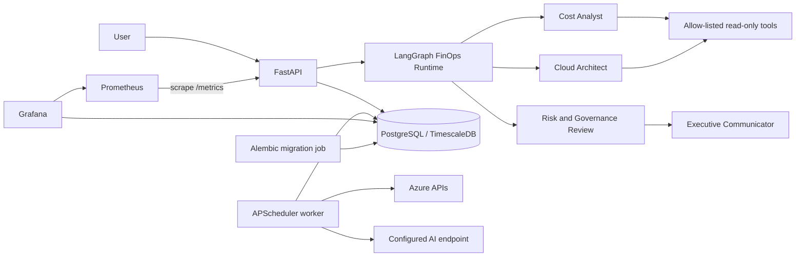

# Architecture

## Runtime

The migration job completes before the API and worker start. The API serves versioned HTTP interfaces and metrics. The worker owns all recurring activity, preventing duplicate schedules when the API scales.

## Code boundaries

- `src/api` contains transport concerns only.
- `src/collection` owns Azure cost ingestion.
- `src/alerting`, `src/forecasting`, and `src/recommendations` contain domain workflows.
- `src/integrations/llm` is the only model-provider construction boundary.
- `src/agents` owns typed graph state, six versioned personas, model-driven read-only tools, policy enforcement, checkpoints, and durable runtime orchestration.
- `src/common` contains configuration, database, logging, and security infrastructure.
- `src/models.py` is the canonical ORM schema.
- `src/scheduler.py` registers recurring jobs.

## Safety

Automated cloud remediation is disabled by default. Recommendations and generated scripts require review. Secrets are supplied at runtime and must not be committed. API readiness verifies both database connectivity and Alembic migration state.

The graph coordinates FinOps Orchestrator, Cost Analyst, Cloud Architect, Optimization Specialist, Risk & Governance Reviewer, and Executive Communicator personas. Cost and architecture specialists can request only centrally registered read-only tools. Governance runs before communication, and refinement, model calls, tool calls, and workflow duration are bounded.

PostgreSQL stores official LangGraph checkpoints separately from domain-owned `agent_runs`, `agent_events`, `agent_messages`, and `agent_artifacts`. These records contain sanitized decisions, evidence, citations, prompt versions, and user-visible summaries—never hidden chain-of-thought. Proposals always require human approval, and approval does not execute a cloud change.

The existing `/api/v1/chat` contract is preserved and switches to LangGraph when the feature flag is enabled. `/api/v2/chat` exposes the explicit agent path. Actor-scoped `/api/v1/agents/runs` endpoints provide status, sanitized events, and artifacts. The scheduler and `agents review` CLI command invoke the same graph.
