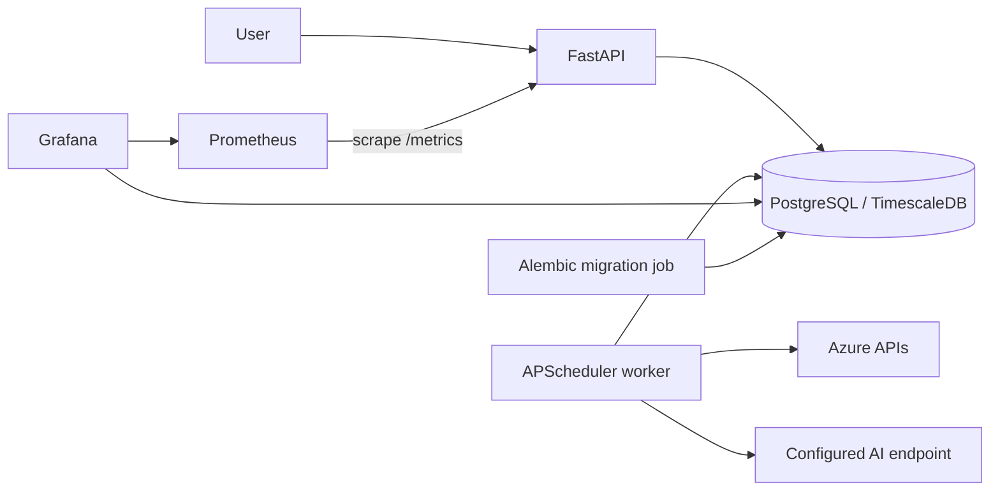

# Architecture

## Runtime

The migration job completes before the API and worker start. The API serves versioned HTTP interfaces and metrics. The worker owns all recurring activity, preventing duplicate schedules when the API scales.

## Code boundaries

- `src/api` contains transport concerns only.
- `src/collection` owns Azure cost ingestion.
- `src/alerting`, `src/forecasting`, and `src/recommendations` contain domain workflows.
- `src/integrations/llm` is the only model-provider construction boundary.
- `src/common` contains configuration, database, logging, and security infrastructure.
- `src/models.py` is the canonical ORM schema.
- `src/scheduler.py` registers recurring jobs.

## Safety

Automated cloud remediation is disabled by default. Recommendations and generated scripts require review. Secrets are supplied at runtime and must not be committed. API readiness verifies both database connectivity and Alembic migration state.
