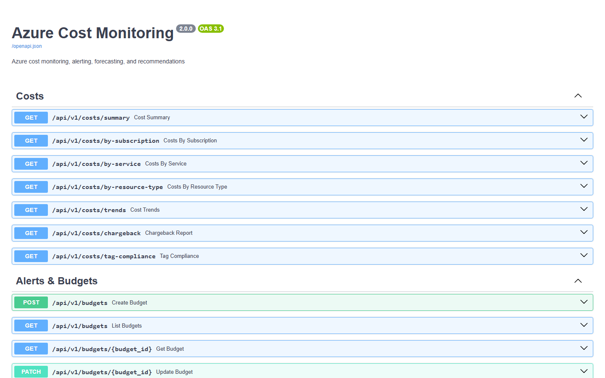
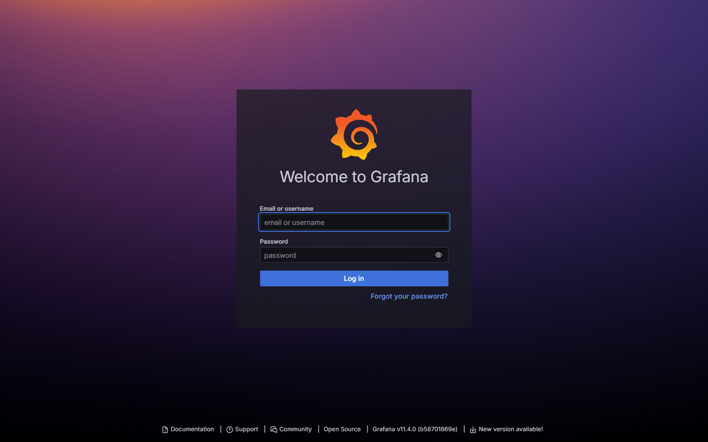
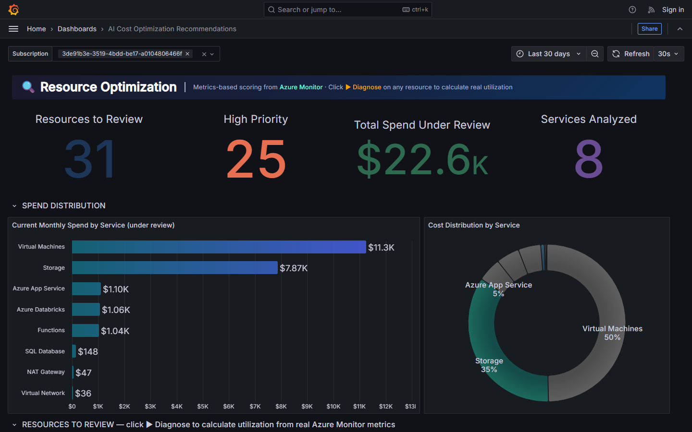
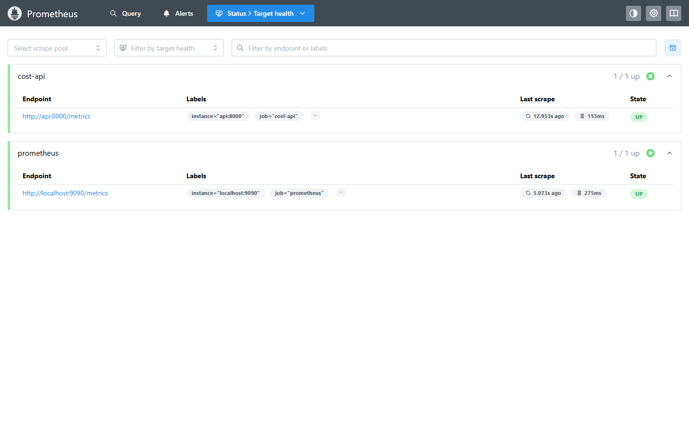

# Docker Setup Guide

This guide starts the complete Azure Cost Monitoring stack locally with Docker Desktop. Commands use PowerShell; Bash users can replace `Copy-Item` with `cp`.

## 1. Prerequisites

Install or obtain:

- Docker Desktop with Docker Compose v2
- Git
- An Azure tenant and one or more accessible subscriptions
- A service principal with `Reader` and `Cost Management Reader` roles, or managed identity when deployed in Azure
- Optional Azure OpenAI or OpenAI-compatible model access

Confirm Docker is running:

```powershell
docker version
docker compose version
```

## 2. Clone and create local configuration

```powershell
git clone https://github.com/nk2242696/CostMonitoringMultiAgent.git
Set-Location CostMonitoringMultiAgent
Copy-Item .env.example .env
```

Open `.env` locally and replace all three `CHANGE_ME` values:

- `POSTGRES_PASSWORD`
- `SECRET_KEY`
- `GRAFANA_ADMIN_PASSWORD`

Use different, long, randomly generated values. The repository ignores `.env`; never paste its content into an issue, commit, log, or screenshot.

## 3. Configure Azure access

For local Docker, configure a service principal:

```dotenv
AZURE_TENANT_ID=<tenant-id>
AZURE_CLIENT_ID=<application-client-id>
AZURE_CLIENT_SECRET=<client-secret>
```

Assign the identity these roles at each monitored subscription or management-group scope:

- `Reader`
- `Cost Management Reader`

Leave `AZURE_SUBSCRIPTION_IDS` blank to discover all accessible subscriptions:

```dotenv
AZURE_SUBSCRIPTION_IDS=
```

To limit collection, provide comma-separated subscription IDs instead. In an Azure-hosted environment with managed identity, leave all three client credential values blank and grant those roles to the managed identity.

## 4. Configure AI recommendations (optional)

Deterministic recommendations require no model:

```dotenv
LLM_PROVIDER=disabled
```

For Azure OpenAI:

```dotenv
LLM_PROVIDER=azure_openai
LLM_BASE_URL=https://<resource-name>.openai.azure.com/
LLM_API_KEY=<api-key>
LLM_MODEL=<deployment-name>
LLM_API_VERSION=2024-12-01-preview
```

`LLM_MODEL` is the Azure deployment name, not necessarily the base model name.

For an OpenAI-compatible endpoint:

```dotenv
LLM_PROVIDER=openai_compatible
LLM_BASE_URL=https://<host>/v1
LLM_API_KEY=<api-key>
LLM_MODEL=<model-name>
```

If model configuration or calls fail, the recommendation workflow retains deterministic guidance.

## 5. Review workspace policy

Edit `config/workspace.yaml` to define non-secret organizational context, required tags, exclusions, budget, risk tolerance, and remediation policy. Do not put credentials in this file.

## 6. Build and start

```powershell
docker compose up --build -d
docker compose ps
```

The expected services are `postgres`, `migrate`, `api`, `worker`, `prometheus`, and `grafana`. The one-shot `migrate` service should exit successfully after applying the schema; the long-running services should be running or healthy.

If startup fails, inspect migration and application logs:

```powershell
docker compose logs migrate
docker compose logs api worker
```

## 7. Verify the API

Open <http://localhost:8000/health>. A healthy installation reports the API status and database connectivity.

Open <http://localhost:8000/docs> to browse and test the REST API.



## 8. Discover subscriptions and collect costs

Validate the effective configuration without displaying credentials:

```powershell
docker compose run --rm api cost-monitor config validate
```

List subscriptions visible to the configured identity:

```powershell
docker compose run --rm api cost-monitor discover-subscriptions
```

Collect the previous 30 days:

```powershell
docker compose run --rm api cost-monitor collect --days 30
```

Keeping `AZURE_SUBSCRIPTION_IDS` blank means the collection applies to all subscriptions discovered for that identity.

## 9. Generate recommendations

After cost data exists, run recommendation generation:

```powershell
docker compose run --rm api cost-monitor recommend
```

With `LLM_PROVIDER=disabled`, the command generates deterministic recommendations. With a valid enabled provider, it also requests model enrichment. Review API or worker logs for provider failures; secrets are not intentionally logged.

## 10. Open Grafana

Open <http://localhost:3000>. Sign in with `GRAFANA_ADMIN_USER` and `GRAFANA_ADMIN_PASSWORD` from your local `.env`.



Open **Dashboards** and select one of the provisioned dashboards:

- Azure Cost Trends
- AI Recommendations
- Architecture Reviews
- Chargeback

Select a subscription for a focused view. On dashboards that support a consolidated view, select **All** to view all collected subscriptions.



Data appears only after a successful collection or when sample data has been loaded intentionally.

## 11. Verify metrics

Open <http://localhost:9090/targets>. Both `cost-api` and `prometheus` should show `UP`.



## 12. Day-to-day commands

```powershell
# Follow logs
docker compose logs -f api worker

# Restart the application after configuration changes
docker compose up -d --force-recreate api worker

# Stop while retaining all volumes
docker compose down

# Start again
docker compose up -d
```

Avoid `docker compose down -v` unless a complete local data reset is intended.

## Troubleshooting

### API or worker does not start

Run `docker compose ps`, then inspect `postgres`, `migrate`, `api`, and `worker` logs. The API and worker wait for a healthy database and a successful migration.

### No subscriptions are found

Verify the tenant and service-principal values, confirm the identity has access at the expected scope, and run `discover-subscriptions` again. All three service-principal fields must be set together.

### No costs appear

Confirm `collect` completed successfully, the Cost Management Reader role has propagated, the requested billing period contains data, and the Grafana subscription filter is set to **All**.

### Recommendations are not AI enriched

Run `cost-monitor config validate` and verify the provider, endpoint, key, model deployment, and API version. The recommendation command must run after cost collection. Provider errors fall back to deterministic content rather than discarding recommendations.

### Grafana has no data

Confirm PostgreSQL is healthy, collection inserted records, and the dashboard time range covers the collected dates. Reload the dashboard after changing the subscription filter.

## Safe publication checklist

Before sharing a fork or screenshot:

1. Confirm `.env` is untracked with `git status --ignored` or `git check-ignore .env`.
2. Search the diff for credentials, tokens, subscription IDs, tenant IDs, endpoint hostnames, and customer resource names.
3. Use only `.env.example` in documentation.
4. Redact live Grafana data when it identifies subscriptions or resources.
5. Rotate any credential that was pasted into a terminal transcript, issue, screenshot, or commit.